# Polyglot Codebase Knowledge Graph

> Generated offline by **readmenator**. Supports C, C++, Python, Go, Rust, JS/TS, Java, C#, Shell, PHP, Dart, GDScript, Nim, ASM.
> No LLMs. No tokens. Pure static analysis.

**Total Files Parsed:** 2 | **Total Symbols Extracted:** 17 | **Total Imports:** 9

## Structural Knowledge Map

```mermaid
graph TD
    classDef mod fill:#1e1e1e,stroke:#ff6666,stroke-width:2px,color:#fff;
    classDef cls fill:#2d2d2d,stroke:#4ec9b0,stroke-width:2px,color:#fff;
    classDef fn fill:#333,stroke:#dcdcaa,stroke-width:1px,color:#dcdcaa;
    classDef ext fill:#111,stroke:#666,stroke-dasharray: 5 5,color:#aaa;
    app_py["app.py (py)"]
    class app_py mod;
    app_py_RealWorldEnvironment["RealWorldEnvironment"]
    class app_py_RealWorldEnvironment cls;
    app_py --> app_py_RealWorldEnvironment
    app_py_measure_spatial_richness["measure_spatial_richness"]
    class app_py_measure_spatial_richness fn;
    app_py --> app_py_measure_spatial_richness
    app_py_HomeostasisEngine["HomeostasisEngine"]
    class app_py_HomeostasisEngine cls;
    app_py --> app_py_HomeostasisEngine
    app_py_LiquidNeuron["LiquidNeuron"]
    class app_py_LiquidNeuron cls;
    app_py --> app_py_LiquidNeuron
    app_py_OrganismV8_Real["OrganismV8_Real"]
    class app_py_OrganismV8_Real cls;
    app_py --> app_py_OrganismV8_Real
    install_sh["install.sh (sh)"]
    class install_sh mod;
    ext_torch["torch"]
    class ext_torch ext;
    app_py -.->|imports| ext_torch
    ext_torch_nn["torch.nn"]
    class ext_torch_nn ext;
    app_py -.->|imports| ext_torch_nn
    ext_torch_nn_functional["torch.nn.functional"]
    class ext_torch_nn_functional ext;
    app_py -.->|imports| ext_torch_nn_functional
    ext_torch_optim["torch.optim"]
    class ext_torch_optim ext;
    app_py -.->|imports| ext_torch_optim
    ext_numpy["numpy"]
    class ext_numpy ext;
    app_py -.->|imports| ext_numpy
    ext_sklearn_datasets["sklearn.datasets"]
    class ext_sklearn_datasets ext;
    app_py -.->|imports| ext_sklearn_datasets
    ext_sklearn_model_selection["sklearn.model_selection"]
    class ext_sklearn_model_selection ext;
    app_py -.->|imports| ext_sklearn_model_selection
    ext_logging["logging"]
    class ext_logging ext;
    app_py -.->|imports| ext_logging
    ext_warnings["warnings"]
    class ext_warnings ext;
    app_py -.->|imports| ext_warnings
```

---

## Architecture Reference

### PY (1 files)

#### `app.py`
**Path:** `app.py`

**Classs:**
- `RealWorldEnvironment` (line 31)
- `HomeostasisEngine` (line 80)
- `LiquidNeuron` (line 99)
- `OrganismV8_Real` (line 136)

**Functions:**
- `measure_spatial_richness` (line 68)
- `run_real_world_challenge` (line 169)
- `__init__` (line 32)
- `get_batch` (line 50)
- `__init__` (line 81)
- `decide` (line 85)
- `__init__` (line 100)
- `forward` (line 108)
- `consolidate_svd` (line 123)
- `__init__` (line 137)
- `forward` (line 147)
- `get_structure_entropy` (line 155)
- `calc_ent` (line 157)

### SH (1 files)

#### `install.sh`
**Path:** `install.sh`

*No symbols extracted*
