# Polyglot Codebase Knowledge Graph

> Generated offline by **readmenator**. Supports C, C++, Python, Go, Rust, JS/TS, Java, C#, Shell, PHP, Dart, GDScript, Nim, ASM, Ruby, Swift, Kotlin, Scala, Lua, Elixir.
> No LLMs. No tokens. Pure static analysis. See more [here](https://github.com/grisuno/ReadMenator)

**Total Files Parsed:** 2 | **Total Symbols Extracted:** 17 | **Total Imports:** 9

<!-- ranking_model: v1.0 | weights: {ppr:0.45,auth:0.2,test:0.15,doc:0.1,fresh:0.1} | alpha:0.85 | commit:75d209c | date:2026-07-18 -->


## Table of Contents

1. [Statistics Dashboard](#statistics-dashboard)
2. [Architectural Layers](#architectural-layers)
3. [Ranked Context](#ranked-context)
4. [God Nodes](#god-nodes)
5. [Suggested Questions](#suggested-questions)
6. [Hotspot Analysis](#hotspot-analysis)
7. [Change Impact Analysis](#change-impact-analysis)
8. [Suggested Linting Rules](#suggested-linting-rules)
9. [Orphans](#orphans)
10. [Query Recipes](#query-recipes)
11. [Structural Knowledge Map](#structural-knowledge-map)
12. [UML Class Diagram](#uml-class-diagram)
13. [Code Property Graph](#code-property-graph)
14. [Architecture Reference](#architecture-reference)
    - [PY (1 files)](#py-1-files)
    - [SH (1 files)](#sh-1-files)

---

## Statistics Dashboard

| Metric | Value |
|--------|-------|
| Total Files | 2 |
| Total Symbols | 17 |
| Total Imports | 9 |
| Call Edges | 112 |
| Inheritance Edges | 3 |
| Languages | 2 |
| Avg Symbols/File | 8.5 |
| Avg Imports/File | 4.5 |

### Top Files by Import Count (Fan-Out)

| File | Imports | Symbols | Language |
|------|---------|---------|----------|
| `app.py` | 9 | 17 | py |

---

## Architectural Layers

Auto-detected from path patterns, naming conventions, and imported frameworks.

| Layer | Files |
|-------|-------|
| utility | 2 |

### utility

- `app.py` (py, 17 symbols)
- `install.sh` (sh, 0 symbols)

---

## Ranked Context

Files ranked by composite score for the current query context. The ranking combines Personalized PageRank (query relevance), global authority, test coverage, documentation coverage, and code freshness. Model: v1.0.

| Rank | File | Composite | PPR | Authority | Test | Doc |
|------|------|-----------|-----|-----------|------|-----|
| 1 | `app.py` | 0.0059 | 0.0000 | 0.0000 | 0.00 | 0.06 |
| 2 | `install.sh` | 0.0000 | 0.0000 | 0.0000 | 0.00 | 0.00 |

---

## God Nodes

Most architecturally central files ranked by combined import/export degree and symbol richness.

| File | Score | Connections | PageRank |
|------|-------|-------------|----------|
| `app.py` | 1.7 | | 0.0000 |
| `install.sh` | 0.0 | | 0.0000 |

---

## Suggested Questions

Auto-generated exploration prompts based on graph structure:

- What does app.py depend on, and what depends on it? (0 connections)
- What does install.sh depend on, and what depends on it? (0 connections)
- What is RealWorldEnvironment in app.py and how is it used?
- What is the overall architecture of this codebase?

---

## Hotspot Analysis

Files ranked by combined complexity (symbol count) and centrality (connection count). High-scoring files are architecturally critical and may need refactoring attention.

| File | Complexity | Centrality | Combined | Symbols | Connections |
|------|-----------|------------|----------|---------|-------------|
| `app.py` | 1.000 | 1.000 | 1.000 | 17 | 9 |
| `install.sh` | 0.000 | 0.000 | 0.000 | 0 | 0 |

---

## Change Impact Analysis

Files sorted by how many other files would be affected if they changed. High-impact files should be changed with caution.

| File | Direct Dependents | Transitive Dependents | Total Impact |
|------|------------------|----------------------|--------------|
| `app.py` | 0 | 0 | 0 |
| `install.sh` | 0 | 0 | 0 |

---

## Suggested Linting Rules

Automatically suggested linting and security rules based on patterns detected in the codebase. These can be exported as Semgrep rules using the `--export-rules` flag.

| Rule ID | Severity | Description | Language | Matches |
|---------|----------|-------------|----------|---------|
| `RM001` | info | Large number of functions in py: 13 total | py | 13 |
| `RM002` | info | Print statement found (consider logging instead) | python | 4 |

---

## Orphans

Files with no documentation or low connectivity. These are candidates for documentation investment or cleanup.

- `install.sh` (0 symbols, no doc)

---

## Query Recipes

Example queries you can run against this knowledge base using the ranking engine:

```
# Find files most relevant to a concept
readmenator query "Where is the import resolver implemented?"

# Rank files by relevance to a topic
readmenator query "How does documentation generation work?"

# Explain why a file ranks highly
readmenator query "explain readmenator/_documentation.py"

# Trace dependency paths with ranked context
readmenator query "path from CLI to exporter"
```

The ranking model uses the following signals:

- **Personalized PageRank** (45% weight): query-specific relevance via seed propagation
- **Global Authority** (20% weight): structural importance via standard PageRank
- **Test Coverage** (15% weight): fraction of symbols referenced in test files
- **Doc Coverage** (10% weight): presence of docstrings and file-level docs
- **Freshness** (10% weight): recent modification activity

Results include score decomposition and justification paths for each ranked item.

---

## Structural Knowledge Map

```mermaid
graph TD
    classDef mod fill:#1e1e1e,stroke:#ff6666,stroke-width:2px,color:#fff;
    classDef cls fill:#2d2d2d,stroke:#4ec9b0,stroke-width:2px,color:#fff;
    classDef fn fill:#333,stroke:#dcdcaa,stroke-width:1px,color:#dcdcaa;
    classDef ext fill:#111,stroke:#666,stroke-dasharray: 5 5,color:#aaa;
    app_py["app.py (py)"]
    class app_py mod;
    app_py_RealWorldEnvironment["RealWorldEnvironment"]
    class app_py_RealWorldEnvironment cls;
    app_py --> app_py_RealWorldEnvironment
    app_py_measure_spatial_richness["measure_spatial_richness"]
    class app_py_measure_spatial_richness fn;
    app_py --> app_py_measure_spatial_richness
    app_py_HomeostasisEngine["HomeostasisEngine"]
    class app_py_HomeostasisEngine cls;
    app_py --> app_py_HomeostasisEngine
    app_py_LiquidNeuron["LiquidNeuron"]
    class app_py_LiquidNeuron cls;
    app_py --> app_py_LiquidNeuron
    app_py_OrganismV8_Real["OrganismV8_Real"]
    class app_py_OrganismV8_Real cls;
    app_py --> app_py_OrganismV8_Real
    install_sh["install.sh (sh)"]
    class install_sh mod;
    ext_torch["torch"]
    class ext_torch ext;
    app_py -.->|imports| ext_torch
    ext_torch_nn["torch.nn"]
    class ext_torch_nn ext;
    app_py -.->|imports| ext_torch_nn
    ext_torch_nn_functional["torch.nn.functional"]
    class ext_torch_nn_functional ext;
    app_py -.->|imports| ext_torch_nn_functional
    ext_torch_optim["torch.optim"]
    class ext_torch_optim ext;
    app_py -.->|imports| ext_torch_optim
    ext_numpy["numpy"]
    class ext_numpy ext;
    app_py -.->|imports| ext_numpy
    ext_sklearn_datasets["sklearn.datasets"]
    class ext_sklearn_datasets ext;
    app_py -.->|imports| ext_sklearn_datasets
    ext_sklearn_model_selection["sklearn.model_selection"]
    class ext_sklearn_model_selection ext;
    app_py -.->|imports| ext_sklearn_model_selection
    ext_logging["logging"]
    class ext_logging ext;
    app_py -.->|imports| ext_logging
    ext_warnings["warnings"]
    class ext_warnings ext;
    app_py -.->|imports| ext_warnings
```



---

## UML Class Diagram

Auto-generated Mermaid class diagram from parsed class-level symbols. Shows classes, structs, interfaces, traits, and their methods with inheritance and dependency relationships.

```mermaid
classDiagram
  class app_py_RealWorldEnvironment {
    <<class>>
    +measure_spatial_richness(activations)
    +run_real_world_challenge()
    +__init__(self)
    +get_batch(self, phase, batch_size)
    +__init__(self)
    +decide(self, task_loss_val, richness_val, vn_entropy_val)
    +__init__(self, in_dim, out_dim)
    +forward(self, x, plasticity_gate)
    +consolidate_svd(self, repair_strength)
    +__init__(self, d_in, d_hid, d_out)
  }
  class app_py_HomeostasisEngine {
    <<class>>
    +measure_spatial_richness(activations)
    +run_real_world_challenge()
    +__init__(self)
    +get_batch(self, phase, batch_size)
    +__init__(self)
    +decide(self, task_loss_val, richness_val, vn_entropy_val)
    +__init__(self, in_dim, out_dim)
    +forward(self, x, plasticity_gate)
    +consolidate_svd(self, repair_strength)
    +__init__(self, d_in, d_hid, d_out)
  }
  class app_py_LiquidNeuron {
    <<class>>
    +measure_spatial_richness(activations)
    +run_real_world_challenge()
    +__init__(self)
    +get_batch(self, phase, batch_size)
    +__init__(self)
    +decide(self, task_loss_val, richness_val, vn_entropy_val)
    +__init__(self, in_dim, out_dim)
    +forward(self, x, plasticity_gate)
    +consolidate_svd(self, repair_strength)
    +__init__(self, d_in, d_hid, d_out)
  }
  class app_py_OrganismV8_Real {
    <<class>>
    +measure_spatial_richness(activations)
    +run_real_world_challenge()
    +__init__(self)
    +get_batch(self, phase, batch_size)
    +__init__(self)
    +decide(self, task_loss_val, richness_val, vn_entropy_val)
    +__init__(self, in_dim, out_dim)
    +forward(self, x, plasticity_gate)
    +consolidate_svd(self, repair_strength)
    +__init__(self, d_in, d_hid, d_out)
  }
```



---

## Code Property Graph

Machine-readable Code Property Graph (CPG) in JSON-LD format. This block allows AI agents to parse the full structural graph without additional file reads. Compatible with GraphRAG pipelines.

```json
{"@context": "https://schema.org", "analysis": {"communities": [], "god_nodes": [{"node_id": "app.py", "score": 1.7}, {"node_id": "install.sh", "score": 0.0}], "surprising_connections": []}, "edges": [{"confidence": "EXTRACTED", "relation": "imports", "source": "app.py", "target": "torch"}, {"confidence": "EXTRACTED", "relation": "imports", "source": "app.py", "target": "torch.nn"}, {"confidence": "EXTRACTED", "relation": "imports", "source": "app.py", "target": "torch.nn.functional"}, {"confidence": "EXTRACTED", "relation": "imports", "source": "app.py", "target": "torch.optim"}, {"confidence": "EXTRACTED", "relation": "imports", "source": "app.py", "target": "numpy"}, {"confidence": "EXTRACTED", "relation": "imports", "source": "app.py", "target": "sklearn.datasets"}, {"confidence": "EXTRACTED", "relation": "imports", "source": "app.py", "target": "sklearn.model_selection"}, {"confidence": "EXTRACTED", "relation": "imports", "source": "app.py", "target": "logging"}, {"confidence": "EXTRACTED", "relation": "imports", "source": "app.py", "target": "warnings"}], "generator": "readmenator", "metadata": {"edge_count": 124, "file_count": 2, "language_count": 2, "symbol_count": 17}, "nodes": [{"doc": "_*_ coding: utf8 _*_", "id": "app.py", "kind": "module", "label": "app.py", "language": "py", "sha256": "9871829806ef8197", "symbol_count": 17, "symbols": [{"kind": "class", "line": 31, "name": "RealWorldEnvironment", "signature": "class RealWorldEnvironment"}, {"kind": "method", "line": 68, "name": "measure_spatial_richness", "signature": "def measure_spatial_richness(activations)"}, {"kind": "class", "line": 80, "name": "HomeostasisEngine", "signature": "class HomeostasisEngine(Module)"}, {"kind": "class", "line": 99, "name": "LiquidNeuron", "signature": "class LiquidNeuron(Module)"}, {"kind": "class", "line": 136, "name": "OrganismV8_Real", "signature": "class OrganismV8_Real(Module)"}, {"kind": "method", "line": 169, "name": "run_real_world_challenge", "signature": "def run_real_world_challenge()"}, {"kind": "method", "line": 32, "name": "__init__", "signature": "def __init__(self)"}, {"kind": "method", "line": 50, "name": "get_batch", "signature": "def get_batch(self, phase, batch_size)"}, {"kind": "method", "line": 81, "name": "__init__", "signature": "def __init__(self)"}, {"kind": "method", "line": 85, "name": "decide", "signature": "def decide(self, task_loss_val, richness_val, vn_entropy_val)"}, {"kind": "method", "line": 100, "name": "__init__", "signature": "def __init__(self, in_dim, out_dim)"}, {"kind": "method", "line": 108, "name": "forward", "signature": "def forward(self, x, plasticity_gate)"}, {"kind": "method", "line": 123, "name": "consolidate_svd", "signature": "def consolidate_svd(self, repair_strength)"}, {"kind": "method", "line": 137, "name": "__init__", "signature": "def __init__(self, d_in, d_hid, d_out)"}, {"kind": "method", "line": 147, "name": "forward", "signature": "def forward(self, x, plasticity_gate)"}, {"kind": "method", "line": 155, "name": "get_structure_entropy", "signature": "def get_structure_entropy(self)"}, {"kind": "method", "line": 157, "name": "calc_ent", "signature": "def calc_ent(W)"}]}, {"id": "install.sh", "kind": "module", "label": "install.sh", "language": "sh", "sha256": "c907d80fd6734993", "symbol_count": 0, "symbols": []}], "type": "CodePropertyGraph", "version": "1.0"}
```

---

## Architecture Reference

### PY (1 files)

#### `app.py`
**Path:** `app.py`
**File Doc:** *_*_ coding: utf8 _*_*

**Classes:**
- `RealWorldEnvironment` (line 31) `class RealWorldEnvironment`
- `HomeostasisEngine` (line 80) `class HomeostasisEngine(Module)`
- `LiquidNeuron` (line 99) `class LiquidNeuron(Module)`
- `OrganismV8_Real` (line 136) `class OrganismV8_Real(Module)`

**Methods:**
- `measure_spatial_richness` (line 68) `def measure_spatial_richness(activations)`
- `run_real_world_challenge` (line 169) `def run_real_world_challenge()`
- `__init__` (line 32) `def __init__(self)`
- `get_batch` (line 50) `def get_batch(self, phase, batch_size)`
- `__init__` (line 81) `def __init__(self)`
- `decide` (line 85) `def decide(self, task_loss_val, richness_val, vn_entropy_val)`
- `__init__` (line 100) `def __init__(self, in_dim, out_dim)`
- `forward` (line 108) `def forward(self, x, plasticity_gate)`
- `consolidate_svd` (line 123) `def consolidate_svd(self, repair_strength)`
- `__init__` (line 137) `def __init__(self, d_in, d_hid, d_out)`
- `forward` (line 147) `def forward(self, x, plasticity_gate)`
- `get_structure_entropy` (line 155) `def get_structure_entropy(self)`
- `calc_ent` (line 157) `def calc_ent(W)`

### SH (1 files)

#### `install.sh`
**Path:** `install.sh`

*No symbols extracted*
